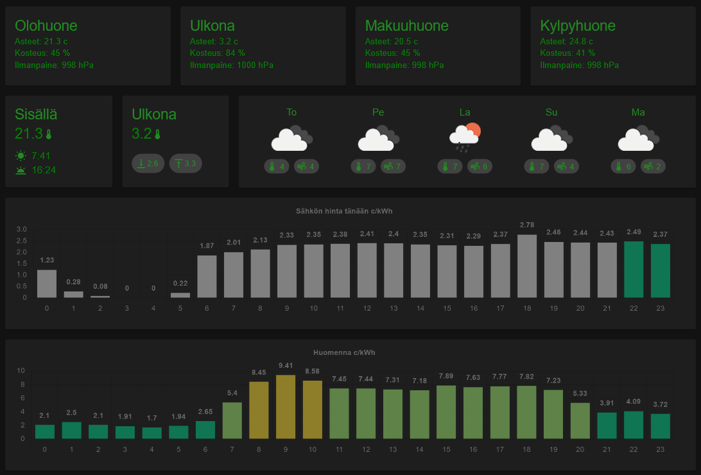

# ruuvi-dashboard

Collect RuuviTag data, run system on Raspberry Pi and visualize using React app.  
App integrates to other services like weather forecast.  
Key points:

- Collect RuuviTag data
- Daily min/max outdoor weather
- Weather forecast
- Sunrise / sunset
- Energy prices today and tomorrow
- Beautiful layout
- No database requirement



Inspired of this article
https://teuvovaisanen.fi/2019/09/09/ruuvitag-raspberry-pi-ja-telegram-bot/

Example how to run React web app on Raspberry Pi and start it when machine starts  
https://blog.cloudboost.io/how-to-run-a-nodejs-web-server-on-a-raspberry-pi-for-development-3ef9ac0fc02c

Example to connect React and Express backend  
https://blog.logrocket.com/running-react-express-concurrently/

Note to my self: Ruuvi

- High battery level: 3193
- Low battery level: 1897

# Roadmap

#### Codebase

- Add tests to code `(in progress)`
- System wide JSDoc typing `(in progress)`
- Refactor code `(in progress)`
- Apply web socket instead of API polling

#### UX

- Refine and polish overall UI, add more icons etc
- Visualize current hour energy price
- Today hourly weather forecast
- Outdoor temperature trend, rise/lower/stay same
- System monitor: Raspberry pi temp (safe under +70c), memory %, cpu %
- Integrate with Philips Hue
- Ruuvi battery level indicator
- Mobile friendly UI, now it works best on pad size

#### System

- PWA support
- Automated log rotation for systemd journal
- Remote deployment improvements

# Quick Start for Raspberry Pi

For a streamlined setup experience, see **[raspberrypi.instructions.md](raspberrypi.instructions.md)** which includes an automated setup script:

```bash
git clone https://github.com/chmc/ruuvi-dashboard.git
cd ruuvi-dashboard
./scripts/setup-raspberry-pi.sh
```

The script handles all dependencies, BLE permissions, and optionally sets up auto-start on boot.

## Enable Raspberry Pi remote access

In GUI OS

- Press Raspberry Button -> Preferences -> Raspberry Pi Configuration
- Select Interfaces tab
- Enable `VNC` for RealVNC Viewer connection
- Enable `SSH` for terminal connection

---

For manual setup or troubleshooting, see the detailed instructions in [raspberrypi.instructions.md](raspberrypi.instructions.md).

---

# Local Development

```bash
git clone https://github.com/chmc/ruuvi-dashboard.git
cd ruuvi-dashboard
pnpm install
pnpm start
```

The app runs in simulator mode when no real RuuviTags are detected.

---

# Useful Commands

```bash
# Raspberry Pi
sudo reboot                    # Reboot
vcgencmd measure_temp          # Check CPU temperature

# Bluetooth
sudo hciconfig hci0 up         # Enable Bluetooth
sudo hciconfig hci0 reset      # Reset Bluetooth

# Service management (if installed)
sudo systemctl status ruuvi-dashboard
sudo systemctl restart ruuvi-dashboard
sudo journalctl -u ruuvi-dashboard -f
```

## How the app (frontend and backend) was created

### Create react app

App will be created inside `ruuvionpi` folder

```
$ npx create-react-app ruuvionpi
```

Tip. If you have troubles running npx command, make install npm globally

```
$ npm install -g npm
```

### Setting up the Express.js backend

Browse to root directory

```
$ mkdir server
$ touch server/index.js
```

Next install the `express` and `nodemon` packages

```
$ npm install express --save
$ npm install nodemon --save-dev
```

Update `server/index.js` file

### Integrate the React with API

Update `package.json` file

```
{
    ...
    "scripts": {
        ...
        "start:frontend": "react-scripts start",
        "start:backend": "nodemon server/index.js"
    },
    "proxy": "http://localhost:3001"
}
```

The `proxy` field specifies the proxy server that will be used in development. It is set to http://localhost:3001, meaning any API requests made from the React frontend to endpoints starting with `/api` will be automatically proxied to the Express backend server running on port 3001.

### Install and configure concurrently

With concurrently it is possible to start frontend and backend at the same time

```
$ npm install concurrently
```

Update `package.json`

```
"scripts": {
    ...
    "start:frontend": ...,
    "start:backend": ...,
    "start": "concurrently \"npm run start:frontend\" \"npm run start:backend\""
}
```
