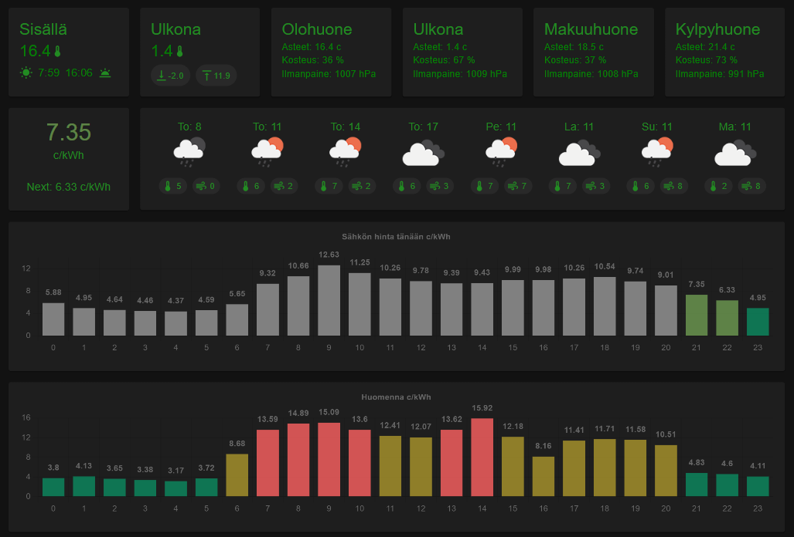

# ruuvi-dashboard

Collect RuuviTag data, run system on Raspberry Pi and visualize using React app.  
App integrates to other services like weather forecast.  
Key points:

- Collect RuuviTag data
- Daily min/max outdoor weather
- Weather forecast
- Sunrise / sunset
- Energy prices today and tomorrow
- Beautiful layout
- **History tracking** with SQLite database
- **Trend indicators** on dashboard cards
- **Diagnostics screen** for system monitoring



## Features

### History Tracking

The dashboard stores sensor readings in a SQLite database, allowing you to view historical data:

- **Time ranges**: 1 hour, 6 hours, 24 hours, 7 days, 30 days, or all data
- **Interactive charts**: View temperature, humidity, and pressure over time
- **Sparkline previews**: Quick visual overview for each sensor
- **Multi-metric display**: Compare multiple metrics simultaneously

Access the History screen via the floating navigation button (Speed Dial) in the bottom-right corner.

### Trend Indicators

Dashboard cards display trend arrows showing whether readings are rising, falling, or stable:

- ↑ Rising (green)
- ↗ Rising slightly
- → Stable (gray)
- ↘ Falling slightly
- ↓ Falling (red)

Trends are calculated by comparing current readings to values from 30 minutes ago.

### Diagnostics Screen

Monitor system health and manage data storage:

- **Buffer Status**: View buffered readings count and last flush time
- **Battery Levels**: Monitor RuuviTag battery voltages with color-coded indicators
- **System Info**: Database size, oldest record, server uptime
- **Manual Flush**: Force buffer flush to database on demand

### Data Retention Policy

To optimize storage (especially on SD cards), older data is automatically downsampled:

| Age | Resolution |
|-----|------------|
| < 24 hours | 1-minute intervals (raw data) |
| 24h - 7 days | 5-minute averages |
| > 7 days | Hourly averages |

Aggregation preserves average temperature, humidity, pressure, and minimum battery voltage.

### SD Card Protection (Advanced)

For Raspberry Pi deployments, sensor readings are buffered in memory and flushed to SQLite every 15 minutes by default. This reduces SD card writes and extends card lifespan.

**Optional tmpfs buffer**: For additional protection, you can enable RAM-based buffer persistence that survives service restarts (but not reboots):

1. Create a tmpfs mount point:
   ```bash
   sudo mkdir -p /var/ruuvi-buffer
   sudo mount -t tmpfs -o size=10M tmpfs /var/ruuvi-buffer
   ```

2. Add to `/etc/fstab` for persistence across reboots:
   ```
   tmpfs /var/ruuvi-buffer tmpfs size=10M,mode=755 0 0
   ```

3. Enable in your `.env` file:
   ```bash
   RUUVI_USE_TMPFS_BUFFER=true
   RUUVI_TMPFS_PATH=/var/ruuvi-buffer
   ```

Inspired of this article
https://teuvovaisanen.fi/2019/09/09/ruuvitag-raspberry-pi-ja-telegram-bot/

Example how to run React web app on Raspberry Pi and start it when machine starts  
https://blog.cloudboost.io/how-to-run-a-nodejs-web-server-on-a-raspberry-pi-for-development-3ef9ac0fc02c

Example to connect React and Express backend  
https://blog.logrocket.com/running-react-express-concurrently/

Note to my self: Ruuvi

- High battery level: 3193
- Low battery level: 1897

# Roadmap

#### Completed

- ✅ Outdoor temperature trend indicators
- ✅ Ruuvi battery level indicator (Diagnostics screen)
- ✅ System monitor (Diagnostics screen)
- ✅ Historical data storage and visualization
- ✅ Data retention with automatic aggregation
- ✅ Systemd service with graceful shutdown

#### In Progress

- Add tests to code
- System wide JSDoc typing
- Refactor code

#### Future

- Apply web socket instead of API polling
- Refine and polish overall UI
- Visualize current hour energy price
- Today hourly weather forecast
- PWA support
- Mobile friendly UI

# Quick Start for Raspberry Pi

For a streamlined setup experience, see **[raspberrypi.instructions.md](raspberrypi.instructions.md)** which includes an automated setup script:

```bash
git clone https://github.com/chmc/ruuvi-dashboard.git
cd ruuvi-dashboard
./scripts/setup-raspberry-pi.sh
```

The script handles all dependencies, BLE permissions, and optionally sets up auto-start on boot.

## Deploying Updates

After initial setup, use the deployment script to update your Raspberry Pi installation:

```bash
cd ruuvi-dashboard
./scripts/deploy.sh
```

This script will:

- Pull latest code from git
- Install/update dependencies
- Regenerate systemd environment file
- Update systemd service file if template changed (with daemon-reload)
- Gracefully restart the service (data is flushed before shutdown)
- Verify service is running

## Systemd Service

The application runs as a systemd service on Raspberry Pi with the following features:

- **Auto-start on boot**: Service starts automatically after network and Bluetooth
- **Graceful shutdown**: On stop/restart, the service receives SIGTERM which triggers:
  - BLE scanner stops accepting new readings
  - In-memory buffer flushes to SQLite database
  - Process exits cleanly (30 second timeout)
- **Auto-restart**: Service restarts on failure after 10 seconds
- **Logging**: Output available via `journalctl -u ruuvi-dashboard`

The service is configured from a template file at `scripts/ruuvi-dashboard.service`.
Both setup and deploy scripts automatically update the installed service when the template changes.

## Enable Raspberry Pi remote access

In GUI OS

- Press Raspberry Button -> Preferences -> Raspberry Pi Configuration
- Select Interfaces tab
- Enable `VNC` for RealVNC Viewer connection
- Enable `SSH` for terminal connection

---

For manual setup or troubleshooting, see the detailed instructions in [raspberrypi.instructions.md](raspberrypi.instructions.md).

---

# Local Development

```bash
git clone https://github.com/chmc/ruuvi-dashboard.git
cd ruuvi-dashboard
pnpm install
pnpm start
```

The app runs in simulator mode when no real RuuviTags are detected.

---

# Useful Commands

```bash
# Raspberry Pi
sudo reboot                    # Reboot
vcgencmd measure_temp          # Check CPU temperature

# Bluetooth
sudo hciconfig hci0 up         # Enable Bluetooth
sudo hciconfig hci0 reset      # Reset Bluetooth

# Service management (if installed)
sudo systemctl status ruuvi-dashboard
sudo systemctl restart ruuvi-dashboard
sudo journalctl -u ruuvi-dashboard -f
```

## How the app (frontend and backend) was created

### Create react app

App will be created inside `ruuvi-dashboard` folder

```
$ npx create-react-app ruuvi-dashboard
```

Tip. If you have troubles running npx command, make install npm globally

```
$ npm install -g npm
```

### Setting up the Express.js backend

Browse to root directory

```
$ mkdir server
$ touch server/index.js
```

Next install the `express` and `nodemon` packages

```
$ npm install express --save
$ npm install nodemon --save-dev
```

Update `server/index.js` file

### Integrate the React with API

Update `package.json` file

```
{
    ...
    "scripts": {
        ...
        "start:frontend": "react-scripts start",
        "start:backend": "nodemon server/index.js"
    },
    "proxy": "http://localhost:3001"
}
```

The `proxy` field specifies the proxy server that will be used in development. It is set to http://localhost:3001, meaning any API requests made from the React frontend to endpoints starting with `/api` will be automatically proxied to the Express backend server running on port 3001.

### Install and configure concurrently

With concurrently it is possible to start frontend and backend at the same time

```
$ npm install concurrently
```

Update `package.json`

```
"scripts": {
    ...
    "start:frontend": ...,
    "start:backend": ...,
    "start": "concurrently \"npm run start:frontend\" \"npm run start:backend\""
}
```
